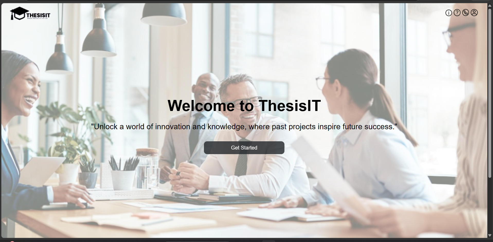
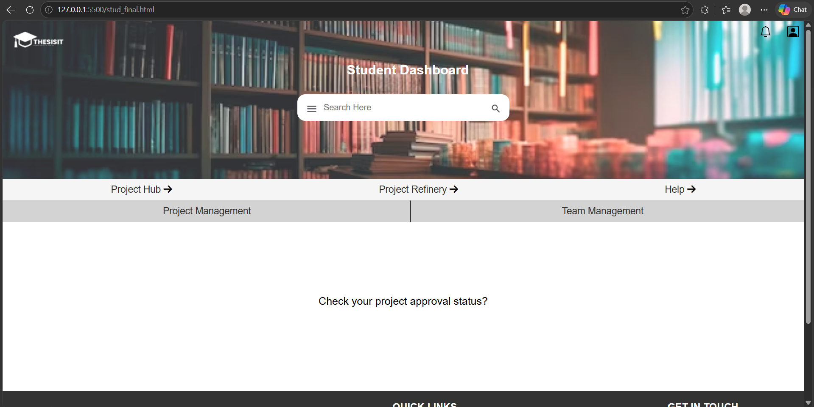
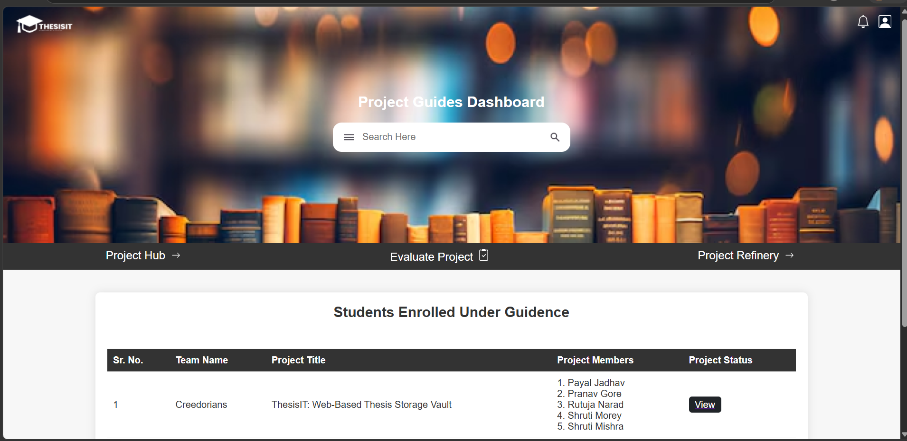
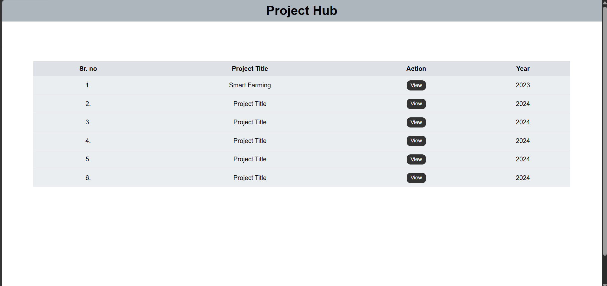
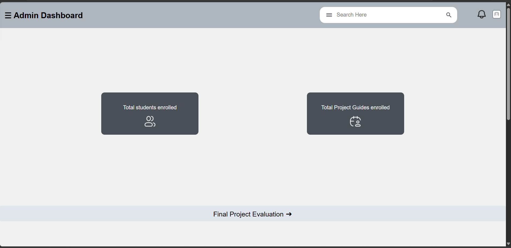

ThesisIT — Web-Based Thesis Storage Vault

> A centralized platform for academic project submission, management, and evaluation — built for students and faculty at Government College of Engineering, Chandrapur (CSE Department).

---

## Table of Contents

- [About the Project](#about-the-project)
- [Features](#features)
- [Tech Stack](#tech-stack)
- [Project Structure](#project-structure)
- [Getting Started](#getting-started)
- [Screenshots](#screenshots)
- [Database Schema](#database-schema)
- [API Overview](#api-overview)
- [Team](#team)

---

## About the Project

Managing final-year project records is time-consuming, inefficient, and prone to data loss — whether stored physically or in scattered digital files. **ThesisIT** solves this by providing a single, organized web platform where:

- Students can **submit and track** their projects across multiple seminar stages
- Faculty/Project Guides can **evaluate and give feedback** at each stage
- Junior students can **browse and learn** from past projects
- Admins can **manage users, groups, and academic records**

---

## Features

| Role | Capabilities |
|------|-------------|
| Student | Register, form groups, submit project details & files per seminar stage, track progress |
| Project Guide | View assigned groups, evaluate seminars, give marks & feedback |
| Admin | Manage all users, groups, guides; monitor submissions |
| Alumni | Past project visibility for knowledge sharing |
| Public | Browse Project Hub — a searchable archive of completed projects |

Key highlights:
- Role-based authentication with JWT (Student / Guide / Admin)
- Multi-stage project submission (up to 6 seminars for Final Year, 3 for Third Year)
- Project Refinery — a space for students to ideate and refine project ideas
- Project Hub — public archive of all completed projects with team details
- File upload support (PPTs, videos, reports, posters, source code)
- Evaluation system with per-member marks across multiple criteria
- Alumni integration for team continuity

---

## Tech Stack

| Layer | Technology |
|-------|-----------|
| Frontend | HTML, CSS, JavaScript |
| Backend | Node.js, Express.js |
| Database | MongoDB (Mongoose ODM) |
| Authentication | JWT (JSON Web Tokens), bcryptjs |
| File Storage | Local / AWS Cloud |
| Design/Prototype | Figma |
| IDE | VS Code |

---

## Project Structure

```
ThesisIT/
├── config/
│   └── database.js          # MongoDB connection
├── middlewares/
│   ├── auth.js              # JWT auth + role checks (Student, Guide, Admin, Leader)
│   └── authMiddleware.js    # Login verification middleware
├── modal/                   # Mongoose models
│   ├── student.js
│   ├── admin.js
│   ├── alumni.js
│   ├── group.js
│   ├── project.js
│   ├── projectGuide.js
│   ├── evaluation.js
│   └── ProjectRefinery.js
├── routes/
│   ├── allRoutes.js         # Public pages (signup, signin, FAQ, etc.)
│   ├── studentRoutes.js     # Student-specific routes
│   ├── adminRoutes.js       # Admin dashboard routes
│   ├── projectGuideRoutes.js# Guide dashboard routes
│   ├── projectRoutes.js     # Project CRUD & file submission
│   ├── projectHubRoutes.js  # Public project archive
│   └── projectRefineryRoutes.js # Project idea submission & browsing
├── views/                   # EJS/HTML templates
├── public/                  # Static assets (CSS, JS, images)
└── app.js / server.js       # Entry point
```

---

## Getting Started

### Prerequisites

- Node.js v18+
- MongoDB (local or Atlas)
- npm

### Installation

```bash
# 1. Clone the repository
git clone https://github.com/shruti1619/ThesisIT_Web-based_thesis-projects_management_system.git

# 2. Navigate to project directory
cd ThesisIT_Web-based_thesis-projects_management_system

# 3. Install dependencies
npm install

# 4. Create a .env file in the root
touch .env
```

### Environment Variables

Create a `.env` file and add:

```env
MONGO_URI=mongodb://localhost:27017/THESIS_STORAGE_VAULT
JWT_SECRET=your_super_secret_key_here
PORT=3000
```

### Run the App

```bash
# Development mode
npm run dev

# OR
node app.js
```

Open your browser and go to: `http://localhost:3000`

---

## Screenshots

> Add screenshots here after capturing them from your running app.

**How to add screenshots:**
1. Take screenshots of your running app (use Windows Snipping Tool or `Ctrl + Shift + S`)
2. Create a folder called `screenshots/` in your repo
3. Upload your images there
4. Replace the placeholder links below with actual paths

```
screenshots/
├── home.png
├── student-dashboard.png
├── guide-evaluation.png
├── project-hub.png
└── admin-panel.png
```

| Page | Preview |
|------|---------|
| Home / Landing Page |  |
| Student Dashboard |  |
| Guide Evaluation Panel |  |
| Project Hub |  |
| Admin Panel |  |

---

## Database Schema (Overview)

| Model | Key Fields |
|-------|-----------|
| `Student` | name, email, rollNo, prn, year, groupId, teamRole |
| `Admin` | name, email, username, adminCode, academicYear |
| `ProjectGuide` | name, email, username, academicYear |
| `Group` | groupName, groupNumber, leader, members[], guideId, projectId |
| `Project` | projectTitle, domain, groupId, submissionStage (0–6), seminar PPTs & videos |
| `Evaluation` | groupId, guideId, seminarNumber, memberMarks[], feedback |
| `Alumni` | name, rollNo, prn, groupId, yearOfPassing |
| `ProjectRefinery` | problemStatement, domain, limitation, futureScope, userId |

---

## API Overview

| Route Prefix | Description |
|---|---|
| `/` | Public pages — home, signup, signin, FAQ |
| `/student` | Student auth, dashboard, group management |
| `/admin` | Admin auth, user/group management |
| `/guide` | Guide auth, evaluation, feedback |
| `/project` | Project submission, file upload per stage |
| `/projecthub` | Public project browsing & alumni details |
| `/projectref` | Project Refinery — idea submission & browsing |

---

## Team

**Team Name:** Creedorians  
**Institution:** Government College of Engineering, Chandrapur  
**Department:** Computer Science & Engineering  
**Guide:** Prof. Rekha Sahare

| Name | Role |
|------|------|
| Shruti Morey | Developer |
| *(Add teammates)* | Developer |

---

## License

This project was built for academic purposes under the supervision of Government College of Engineering, Chandrapur.
